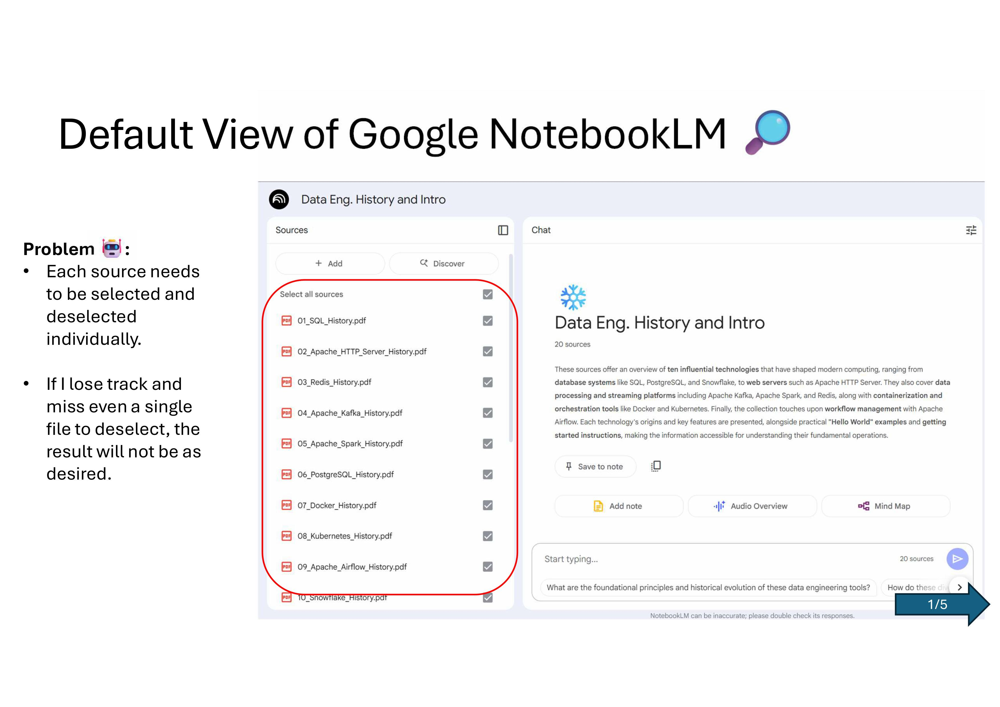
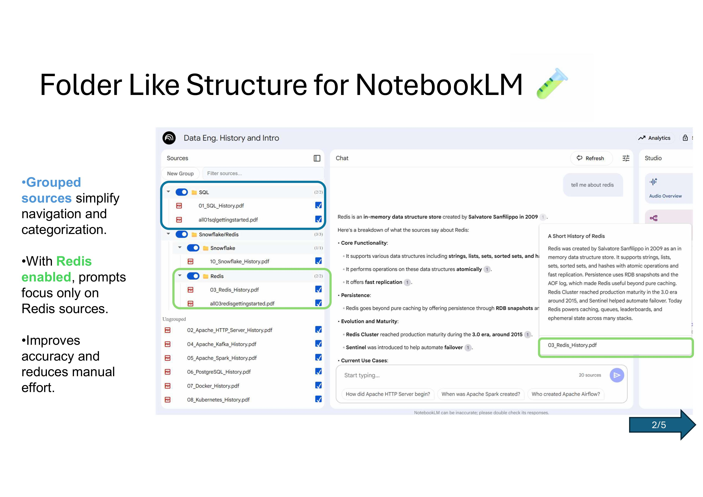
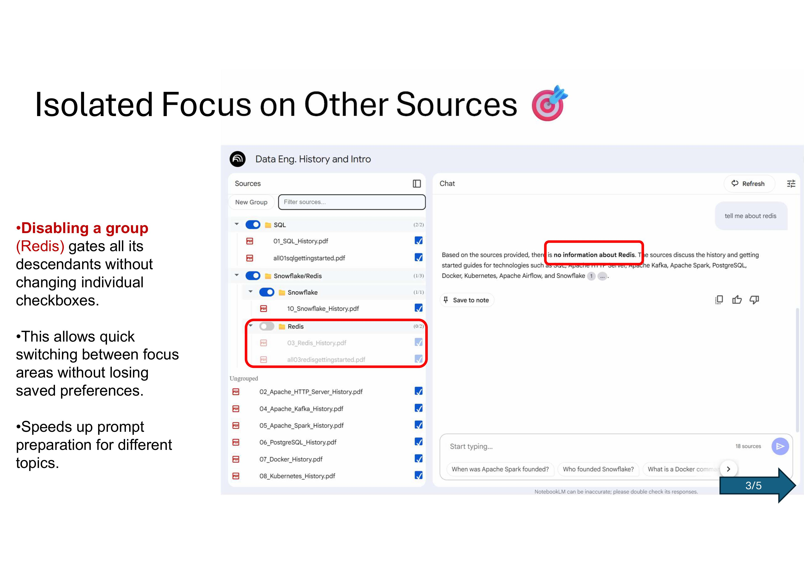
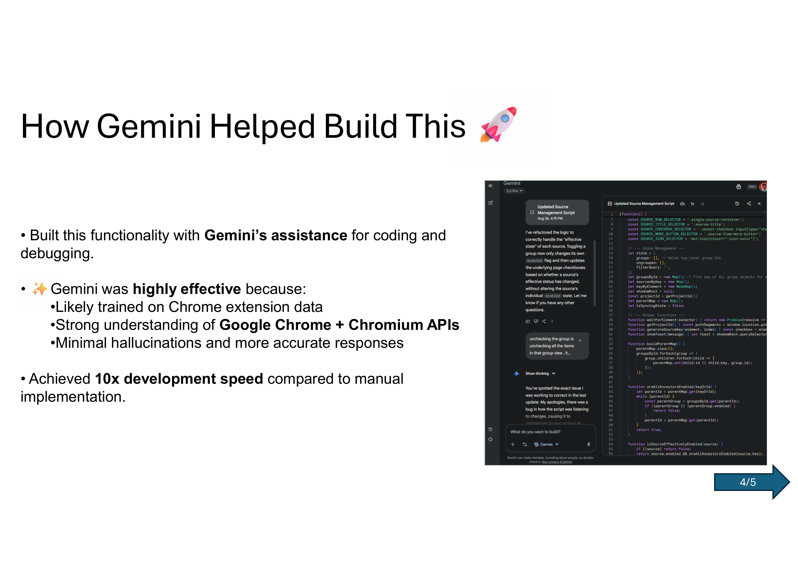
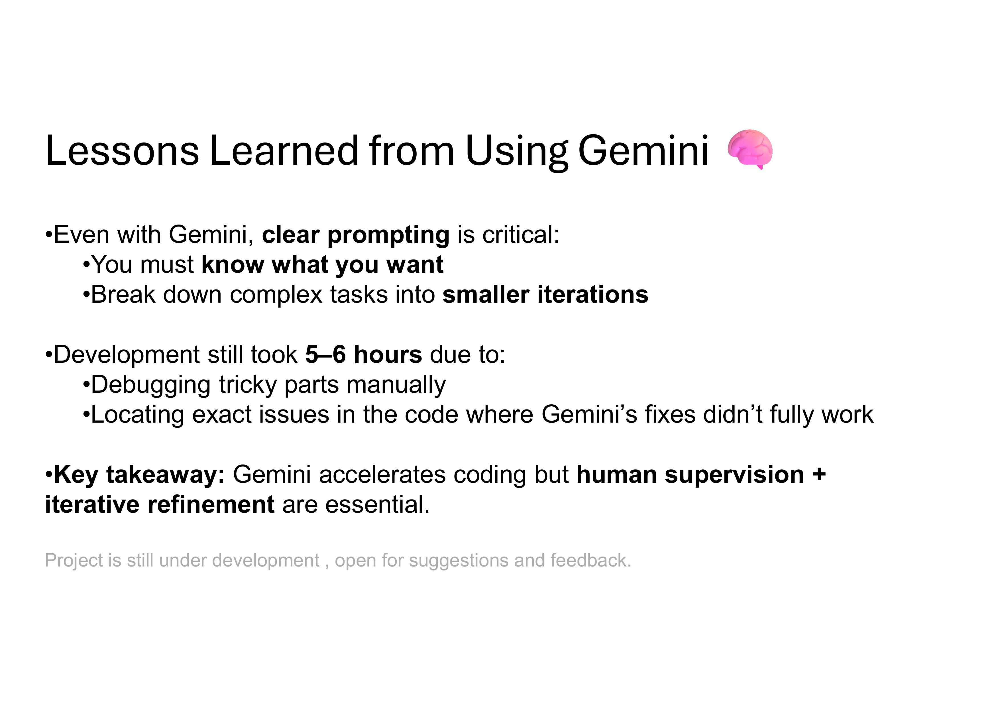

# NotebookLM Sources+

Folder-style grouped sources inside the NotebookLM Sources panel. Focus your prompts by enabling only the groups you care about, without touching individual checkboxes. First prototype; simple, local, and fast.

---

## Status

* First prototype
* Scope is deliberately tight; this README also serves as a lightweight product requirements document

---

## Install

1. Clone or download this repository.
2. Open Chrome, go to `chrome://extensions`, enable Developer mode.
3. Click **Load unpacked**, select the repository folder.
4. Open a NotebookLM notebook, refresh the page.
   You will see the Sources+ controls under the Sources panel header.

**Permissions**: `storage` only.
**Data**: grouping and UI state are saved locally per notebook in `chrome.storage.local`. No network calls. No analytics.

---

## What it does

### Implemented features

* [x] Folder-style groups with strict single-parent membership
* [x] Nested subgroups
* [x] Collapse or expand each group, persisted
* [x] Drag and drop sources into groups; move groups into other groups (nesting)
* [x] Inline rename of groups
* [x] Group **Enable** toggle (switch) that gates descendants without changing child checkboxes
* [x] **Isolate group** action that focuses prompts to one group, mirrors effective state to the real NotebookLM list, and keeps child states intact
* [x] Search filter for source titles
* [x] Visual gating for descendants when an ancestor group is disabled (dimmed; still interactive)
* [x] Per-item **More** button proxy that opens the native NotebookLM item menu
* [x] State persistence per notebook; restores on reload
* [x] Default placement for new or unknown items into **Ungrouped**
* [x] Robust keying for sources with duplicate titles (hash plus index fallback)
* [x] Two-way sync with the native list
  \- Tree to DOM: mirrors effective enable by clicking the real inputs
  \- DOM to tree: listens for native checkbox changes and updates the tree
* [x] MutationObserver on the native scroll area to ingest added or removed rows
* [x] Toast notifications for key actions
* [x] Loop guard so mirroring does not re-trigger itself (`isSyncingState`)

### Upcoming or proposed

* [ ] Reorder groups and sources within the same level with before or after drop indicators
* [ ] Export or import grouping JSON for a notebook
* [ ] Keyboard shortcuts (F2 rename; Space toggle source; Enter isolate; Arrow keys move focus; Ctrl or Cmd Shift G new group)
* [ ] Quick actions in header: Collapse all, Expand all, Enable none
* [ ] Choose default target group for new sources
* [ ] Lightweight virtualization for very large notebooks
* [ ] Context menu on groups: Rename, New subgroup, Move to Ungrouped, Delete
* [ ] Error banner with Retry when selectors are missing or layout changes
* [ ] Frame or idle-batched mirroring for very large toggles
* [ ] Optional label-click fallback for sites that block direct input clicks

If one of these would materially help you, open an issue or add a thumbs up to an existing one.

---

## Why this exists

NotebookLM is powerful for learning and research. Many projects span multiple categories of material. Without grouping, a focused question often requires a long sequence of manual checkbox edits, then undoing those edits later. Sources+ adds a folder-style view with group toggles so you can focus your prompts in seconds, while keeping the native state in sync.

---

## Usage

* **Create group**: click **New Group**. Use the pencil to rename.
* **Add subgroup**: hover a group header and click **Create new folder**.
* **Move sources**: drag a source row into a group. It becomes a child of that group.
* **Nest groups**: drag one group header onto another group to nest it.
* **Toggle group**: use the switch on the group header. Children remain visually as set, but are gated by the group.
* **Isolate group**: click the target icon in the header. Every other group turns off, Ungrouped is off; only this group is effective.
* **Toggle item**: check or uncheck a source. If all ancestors are enabled, the native checkbox flips immediately. If an ancestor is disabled, your preference is saved and will take effect when the ancestor is re-enabled.
* **Filter**: type in the Filter box to show only matching sources.
* **Ungrouped**: items not assigned to any group appear under **Ungrouped**.

---
## Screenshots







---

## Product requirements

### Functional requirements

* Grouping

  * Create groups and subgroups; strict single-parent membership.
  * Move sources between groups by drag and drop.
  * Move groups into other groups. Prevent cycles.

* Toggling and effective state

  * Unchecking a group or subgroup must not uncheck child sources in the tree.
  * A child’s own checkbox reflects only `source.enabled`, never an ancestor’s state.
  * Effective enable for a source is `source.enabled` and every ancestor group is enabled.
  * When an ancestor’s enable state changes, mirror effective changes to the real NotebookLM checkboxes.
  * When a source is toggled while gated by a disabled ancestor, update `source.enabled` only; do not click the native input until the ancestor is re-enabled.

* Isolate mode

  * Isolate sets exactly one group enabled; all others disabled; Ungrouped treated as disabled.
  * Mirror effective state changes to the native list.
  * Preserve each child’s own checkbox state for when isolation is lifted.

* Sync and persistence

  * Two-way synchronisation with the native list within one human-perceivable moment.
  * Persist groups, nesting, names, collapsed flags, and ungrouped membership in `chrome.storage.local` keyed per notebook.
  * Restore on reload.

* Observation

  * Detect added or removed native source rows and ingest them.
  * Default placement for new items: Ungrouped.

* UI and affordances

  * Shadow DOM mount below the panel header in `.source-panel`.
  * Keep the native list in the DOM, but render our view and let the page handle its own rendering.
  * Show a badge with effective counts `(on/total)` for each group.
  * Dim gated descendants to indicate ancestry gating; keep them interactive.

### Non-goals for this prototype

* Real-time collaboration
* Server or network features
* Comments drawer
* Graph view

---

## Architecture and implementation

### Target DOM and selectors

* Panel root: `.source-panel`
* Header row with buttons: `.button-row` (used for relative placement)
* Scroll area: `.scroll-area-desktop`
* Each source row: `.single-source-container`
* Row title: `.source-title`
* Per-source checkbox: `.select-checkbox input[type="checkbox"]` with `aria-label` set to title
* Per-source menu button: `.source-item-more-button`
* Icon inside row: `mat-icon[class*="-icon-color"]`

### Injection strategy

* Create a Shadow DOM container inserted directly below the Sources panel header.
* Render a controls bar and the grouped tree inside the Shadow DOM.
* The native list remains intact. The extension reads from it and mirrors to it.

### Identity and keys

* SourceKey is a hash of the checkbox `aria-label` or title.
* A stable fallback suffix `_index` is appended when collisions occur for equal titles in the same notebook.

### State model

```ts
type SourceKey = string;

interface GroupChild {
  type: 'group' | 'source';
  id?: string;      // for groups
  key?: SourceKey;  // for sources
}

interface Group {
  id: string;
  title: string;
  enabled: boolean;
  collapsed: boolean;
  children: GroupChild[];
}

interface State {
  groups: string[];                        // top-level group ids
  groupsById: Record<string, Group>;       // flat map of all groups
  ungrouped: SourceKey[];
  filterQuery: string;
}
```

Runtime helpers:

* `sourcesByKey: Map<SourceKey, { key, title, element, enabled, iconName, iconColorClass }>`
* `parentMap: Map<string, string>` for quick ancestor checks
* `areAllAncestorsEnabled(idOrKey)` and `isSourceEffectivelyEnabled(source)`

### Mirroring logic

* Tree to DOM
  For any change that alters a source’s effective enabled state, click the corresponding native checkbox to match. Guard with `isSyncingState` to avoid echo loops.

* DOM to tree
  Listen on `document` for `change` events targeting native checkboxes. If not currently syncing, update `source.enabled`, then render and save.

### Observation

* A `MutationObserver` on `.scroll-area-desktop` watches for added or removed rows.
* On any significant change, re-scan the list, update maps, rebuild `parentMap`, and mirror effective state.

### Performance considerations

* DOM work is scoped inside the Shadow DOM.
* Mirroring is guarded to avoid thrash.
* Planned: rAF or idle-batched clicks for very large groups.

### Security and privacy

* No network access.
* Only `storage` permission.
* All titles are read with `textContent` to avoid HTML injection.
* Not affiliated with Google.

---

## Acceptance criteria

* [x] Create group; subgroup; rename inline; persisted across reloads
* [x] Drag sources between groups; nesting works; no cycles when moving groups
* [x] Toggle group off; child checkboxes remain visually unchanged; NotebookLM excludes those children
* [x] Toggle group on; NotebookLM re-enables only descendants whose own `source.enabled` is true
* [x] Toggle a source while its ancestor group is off; tree reflects the change; native checkbox does not flip until the ancestor is on
* [x] Isolate group; only that group is effective; leaving isolation restores prior preferences
* [x] Add new source; appears in Ungrouped; filter works as expected
* [x] Remove a native source; it disappears from the tree within one moment
* [x] Reload; state and collapsed flags restore exactly

---

## Troubleshooting

* **Grouped view did not appear**
  Refresh the page. If it still does not render, NotebookLM markup may have changed. Open DevTools and copy the Sources panel HTML into an issue.

* **Native checkboxes flicker**
  This can happen with very large groups. It is cosmetic. Planned fix is to batch DOM clicks with rAF or `requestIdleCallback`.

* **I moved a group into itself**
  The code prevents cycles. If you find a path that allows it, please file a bug with steps.

* **Reset extension state**
  Remove the extension and load it again, or run `chrome.storage.local.clear()` in DevTools as a last resort.

---

## Contributing

Fork the repository and experiment. This is intentionally straightforward content-script code.

Suggested workflow:

```bash
git clone https://github.com/ramitdour/notebooklm-source-plus
cd notebooklm-source-plus
git checkout -b feature/your-change
# Make your edits, then:
git commit -am "Describe your change"
git push origin feature/your-change
# Open a pull request
```

When opening a PR, include a short description, before or after screenshots if visual, and a brief test plan. Keep scope small and focused.

---

## License

MIT. See `LICENSE`.

---

## Notes for reviewers

* The group toggle is implemented as a switch, not a tri-state checkbox. This keeps the mental model simple and respects per-item preferences.
* Visual gating indicates ancestry-level disabling, but does not block interactions.
* The extension mirrors only effective changes to the native list. This is critical for correctness and performance.

If you have feedback or a feature that would make this 10x more useful for your workflow, open an issue or fork and try it.
